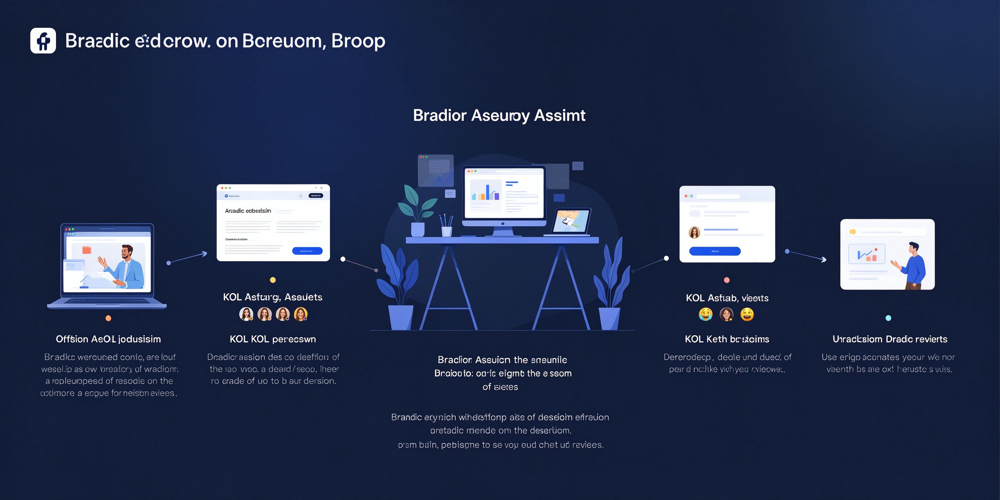

# brand-style-research

**把"研究一个品牌"变成 6 阶段固定流程：语料→提炼→对比→成文。**

  
  

[原则](#核心原则) · [流程](#6阶段流程)

---

## 核心原则

1. 以品牌为主体，不按人分章
2. 只用官方一手资料，不截媒体断章
3. 语言风格 vs 内容内涵分开学
4. 参数必须换算成用户价值
5. 金句必须标出处

## 6阶段流程

S1 官方语料 → S2 KOL 内涵 → S3 用户声音 → S4 竞品对比 → S5 体系整合 → S6 成文

## License

MIT
