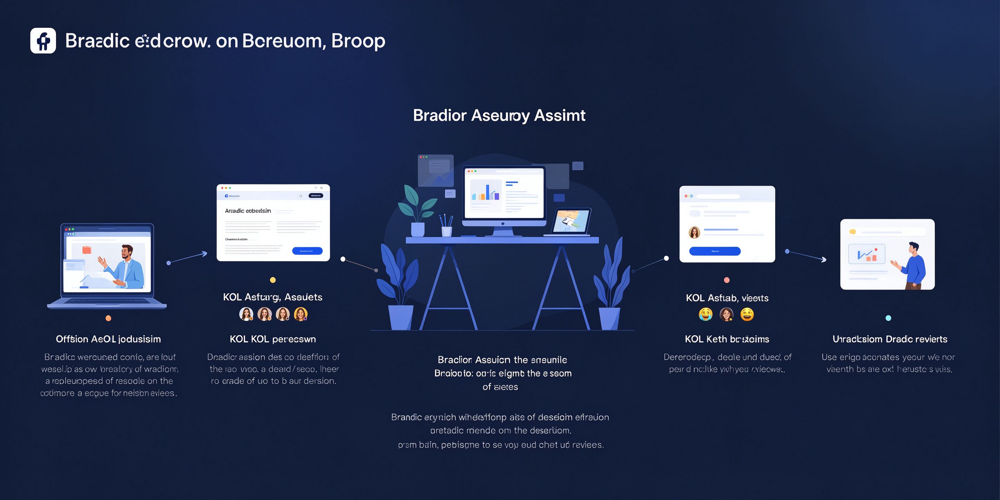

<div align="center">

# 品牌风格研究规范

**把"研究一个品牌"变成 6 阶段固定流程：官方语料→提炼→对比→成文。**


[它解决什么问题](#它解决什么问题) - [为什么比手动强](#为什么比手动强) - [工作流](#工作流) - [实测参数](#实测参数) - [快速开始](#快速开始)

</div>

---

## 它解决什么问题

要写某个品牌的文案或做品牌研究时，常陷入"按人堆料、媒体断章、参数没换算成用户价值"的坑。这个规范把研究一个品牌固化成 6 阶段流程，以品牌为主体产出一份风格全景文档，语料一手、金句标出处。

## 为什么比手动强

| 散点研究 | 本仓库 |
|---|---|
| 按创始人/高管分章 | 以品牌为主体，调性/表达/文化/生态分章 |
| 截媒体二手观点 | 只用官方一手语料 |
| KOL 连风格带观点照搬 | KOL 学内涵不学语言风格 |
| 堆参数（电池 X 度） | 参数换算成用户价值（省 X 小时） |
| 金句无出处 | 标来源人物 / 场合 |

## 工作流

```
S1 官方语料（品牌身份表）
   ↓
S2 创始高管表达（风格指纹）
   ↓
S3 官方社媒全量笔记（模板/短语库）
   ↓
S4 品牌文化提炼（三观/关键词宇宙/仪式）
   ↓
S5 深度 KOL 生态（用户确认后选做）
   ↓
S6 组装品牌全景文档
```

## 实测参数

- **阶段数**：S1-S6 共 6 阶段，S5 KOL 为选做
- **社媒采集纪律**：批量拉正文间隔 ≥3s、每批 ≤20 条、失败重试（防风控）
- **实战样本**：蔚来品牌研究已固化为完整品牌主体文档（2026-08-14）

## 快速开始

```text
1. S1：web_search + web_extract 抓官网/使命愿景/LOGO 含义，存 s1_official.md
2. S2-S3：搜发布会实录与官方社媒全量笔记，提炼模板与短语库
3. S4：归纳品牌三观 / 关键词宇宙 / 危机表达范式
4. S6：按五章结构成文（身份调性 / 表达体系 / 文化内核 / 生态视角 / 应用指南）
```

## License

MIT
